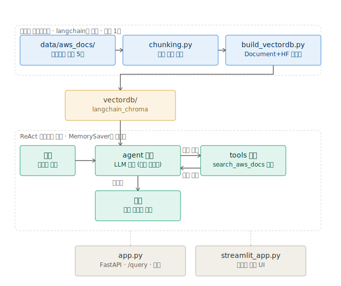

# 8주차 — langgraph (LangGraph ReAct 에이전트)

`langchain`의 LCEL 체인을 LangGraph `StateGraph` 기반 ReAct 에이전트로 마이그레이션. 검색을 Tool로 등록해서, LLM이 검색 필요 여부와 횟수를 스스로 판단하게 만들었다.

## 과제 요구사항 대조

| 요구사항 | 상태 |
|---|---|
| LangChain RAG → LangGraph StateGraph 마이그레이션 | ✅ `graph.py` |
| 그래프를 AI Agent로 발전 | ✅ Tool Calling(ReAct) — `search_aws_docs`를 LLM이 스스로 호출 |
| FastAPI로 REST API 배포 | ✅ `app.py` (`/query`, `thread_id`로 멀티턴 지원) |

## 구조도



## alex-rag `graph.py` 대비 뭐가 다른가

alex-rag의 `graph.py`는 `add_edge(START, "retrieve")` → `add_edge("retrieve", "generate")`만 있어서, **사실상 분기가 전혀 없는 고정 파이프라인**이었다 (그래프가 준 이득은 `MemorySaver` 메모리뿐). 여기서는 검색을 `@tool`로 등록하고 `add_conditional_edges(..., tools_condition)`으로 실제 판단 분기를 넣었다.

| | alex-rag `graph.py` | `langgraph` |
|---|---|---|
| 검색 실행 | 항상 강제 실행 | LLM이 필요할 때만 스스로 호출 (여러 번도 가능) |
| 그래프 분기 | 없음 (`add_edge`만 사용) | 있음 (`add_conditional_edges` + `tools_condition`) |
| 도구화 | 없음 (그냥 함수 호출) | `search_aws_docs`를 Tool로 등록, LLM이 이름 보고 판단 |
| 대화 기억 | `MemorySaver` + `thread_id` | 동일 (그대로 채택) |

## 구조

```
data/aws_docs/*.md   AWS 문서 샘플 (langchain과 동일)
chunking.py          헤더 기반 청킹 (langchain에서 재사용)
build_vectordb.py    문서 → Document → HuggingFace 임베딩 → langchain_chroma 영구 저장 (langchain 재사용)
graph.py             ReAct 에이전트: search_aws_docs Tool + agent/tools 노드 루프 + MemorySaver
app.py               FastAPI (/query, /health) — lifespan에서 그래프 웜업, thread_id로 멀티턴
streamlit_app.py     Streamlit 채팅 UI — 세션 동안 thread_id 유지, "새 대화 시작" 버튼으로 초기화
```

## 실행 방법

```bash
cd langgraph
source .venv/bin/activate
cp .env.example .env               # ANTHROPIC_API_KEY, LANGCHAIN_API_KEY 입력 필요
python build_vectordb.py           # 최초 1회
uvicorn app:app --reload           # REST API 서버 (터미널 1)
streamlit run streamlit_app.py     # 채팅 UI (터미널 2)
```

## 왜 이렇게 구성했나

- **검색을 Tool로 뺀 이유**: `langchain`까지는 검색이 항상 하드코딩되어 실행됐다. Tool로 등록하면 LLM이 "이 질문엔 검색이 필요 없다"거나 "한 번 더 검색해야겠다"를 스스로 판단할 수 있어, 진짜 에이전트(ReAct)가 된다.
- **출처 인용 방식이 바뀜**: 이전 단계들은 `sources` 필드로 구조화해서 반환했는데, Tool 방식에서는 검색 결과가 문자열로 LLM에게 들어가서 그 형태를 그대로 유지하기 어렵다. 대신 시스템 프롬프트에서 "답변 끝에 출처를 나열하라"고 지시해서, 답변 텍스트 안에 인라인으로 출처가 포함되게 했다.
- **`/ask`가 아니라 `/query`로 이름 변경**: 이전 단계는 매번 새 질문(무상태)이었지만, 이제 `thread_id`로 대화가 이어지는 것이 핵심이라 alex-rag의 네이밍(`/query`)을 따름.

## 알려진 제약

- 출처가 구조화된 필드(`sources` 리스트)가 아니라 답변 텍스트에 인라인으로 포함됨 (위 참고).
- 도구를 여러 번 호출하는 경우 응답 시간이 길어질 수 있음 (매 도구 호출마다 LLM을 다시 부름).
